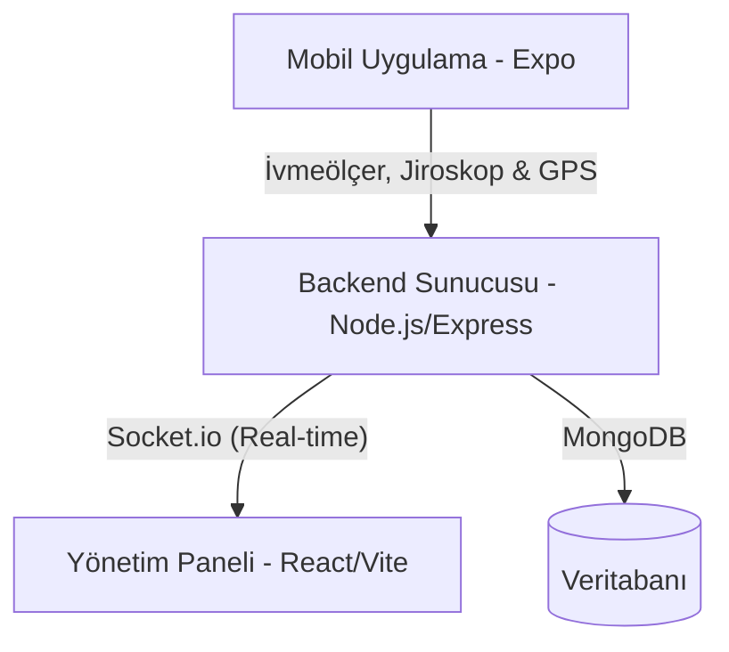

# 🛡️ Sense Guard — Mobil Güvenlik ve Anomali Tespit Platformu

Sense Guard, yaşlılar, hastalar veya yalnız çalışan bireylerin güvenliğini sağlamak amacıyla geliştirilmiş, gerçek zamanlı sensör analitiği, konum takibi ve anomali/düşme tespiti yapan uçtan uca (End-to-End) bir platformdur.

Sistem; sensör verilerini toplayan bir **Mobil Uygulama (React Native/Expo)**, verileri analiz eden ve alarmları yöneten bir **Backend Sunucusu (Node.js/Express/MongoDB)** ve tüm operasyonun izlendiği bir **Yönetim Paneli (React/Vite)** bileşenlerinden oluşur.

---

## 🏗️ Sistem Mimarisi ve Bileşenler



### 1. 📱 Mobil İstemci (`client-mobile`)
Hastanın veya kullanıcının telefonunda çalışan mobil uygulamadır.
* **Sensör Akışı:** İvmeölçer (Accelerometer) ve Jiroskop (Gyroscope) verilerini arka planda sürekli okur.
* **Konum Takibi:** `expo-location` ile kullanıcının GPS konumunu hem ön planda hem de arka planda izler ve sunucuya gönderir.
* **Bağlantı Ayarı:** Farklı IP adreslerine ve sunuculara dinamik olarak bağlanabilecek yapıya sahiptir.

### 2. 💻 Yönetim Web Paneli (`client-web`)
Operatörlerin veya hekimlerin hastaları ve alarmları izlediği arayüzdür.
* **Genel Bakış (Dashboard):** Canlı istatistikler, aktif alarmlar ve sistem durum grafikleri.
* **Canlı Harita (Live Map):** Harita üzerinde tüm hastaların son konumları ve aktif acil durum lokasyonları izlenebilir.
* **Hasta Yönetimi:** Hastaların tıbbi detayları, acil durum yakınları yönetilebilir. Tekli/toplu kalıcı kayıt silme fonksiyonları mevcuttur.

### 3. ⚙️ Sunucu ve Analiz Merkezi (`server`)
Tüm verilerin işlendiği, veri tabanına kaydedildiği ve alarmların üretildiği ana merkezdir.
(Belirlenen eşik değerleri deney amaçlıdır, değiştirilebilir.)
* **Düşme Tespiti Algoritması (3 Fazlı):**
  1. *Serbest Düşüş (Freefall):* İvme magnitude değeri $SV < 0.4g$ olması durumu.
  2. *Darbe (Impact):* Serbest düşüşten sonraki 1 saniye içinde $SV > 2.0g$ darbe algılanması.
  3. *Hareketsizlik (Post-fall):* Darbe sonrası 5 saniye boyunca ivme varyansının $0.1g$'nin altında kalması.
* **Hareketsizlik ve GPS Durağanlık Kontrolü:** Hastadan belirli bir süre veri gelmemesi veya konumunun uzun süre değişmemesi durumunda otomatik alarm üretir.

---

## 🛠️ Kullanılan Teknolojiler

* **Backend:** Node.js, Express.js, MongoDB (Mongoose), Socket.io, Node-cron
* **Web Frontend:** React.js, Vite, Axios, Chart.js, React Leaflet (OpenStreetMap)
* **Mobil Frontend:** React Native, Expo, Expo Router, Expo Sensors, Expo Image

---

## 🚀 Kurulum ve Çalıştırma

Projenin yerel ortamda ayağa kaldırılması için aşağıdaki adımları uygulayın.

### 📋 Ön Gereksinimler
* Bilgisayarınızda **Node.js** (v18+ önerilir) kurulu olmalıdır.
* Bilgisayarınızda yerel **MongoDB** sunucusu çalışıyor olmalıdır (bağlantı adresi varsayılan: `mongodb://localhost:27017`).

---

### 1. Backend Sunucusunun Başlatılması

```bash
cd server
npm install
# .env dosyasını yapılandırın (ayrıntılar aşağıda)
node server.js
```

### 2. Web Yönetim Panelinin Başlatılması

```bash
cd client-web
npm install
# .env dosyasını yapılandırın (ayrıntılar aşağıda)
npm run dev
```
*Tarayıcınızda `http://localhost:3000` adresinden yönetim paneline erişebilirsiniz.*

### 3. Mobil Uygulamanın Başlatılması

```bash
cd client-mobile
npm install
# .env dosyasını yapılandırın (ayrıntılar aşağıda)
npx expo start
```
*Metro Bundler açıldığında telefonunuzdaki **Expo Go** uygulaması ile QR kodu okutarak uygulamayı başlatabilirsiniz.*

---

## ⚙️ Çevre Değişkenleri (.env Yapılandırması)

Projelerin kök dizinlerinde bulunan `.env` dosyaları üzerinden marka adı, logo ve bağlantı ayarları kolayca özelleştirilebilir.

### 📄 Server `.env` Dosyası (`server/.env`)
```env
PORT=5000
MONGO_URI=mongodb://localhost:27017/proje_adiniz
JWT_SECRET=super_secret_key
APP_NAME=Sense Guard
APP_LOGO=logo.svg
```

### 📄 Web `.env` Dosyası (`client-web/.env`)
```env
VITE_APP_NAME=Sense Guard
VITE_APP_SUBTEXT=Güvenlik Web Platformu
VITE_APP_LOGO=/logo.svg
VITE_API_URL=http://localhost:5000/api
VITE_SOCKET_URL=http://localhost:5000
```

### 📄 Mobil `.env` Dosyası (`client-mobile/.env`)
```env
EXPO_PUBLIC_APP_NAME=Sense Guard
EXPO_PUBLIC_APP_SUBTEXT=Sensör Akışı ve Davranış Analizi İstemcisi
EXPO_PUBLIC_APP_LOGO=logo.svg
```

---